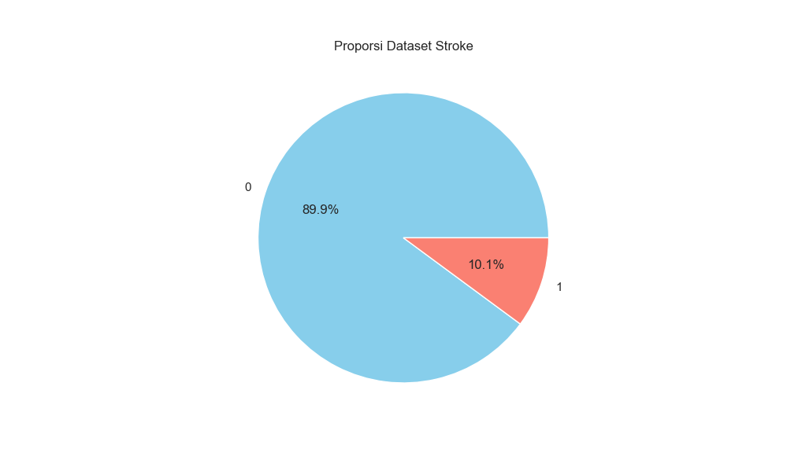
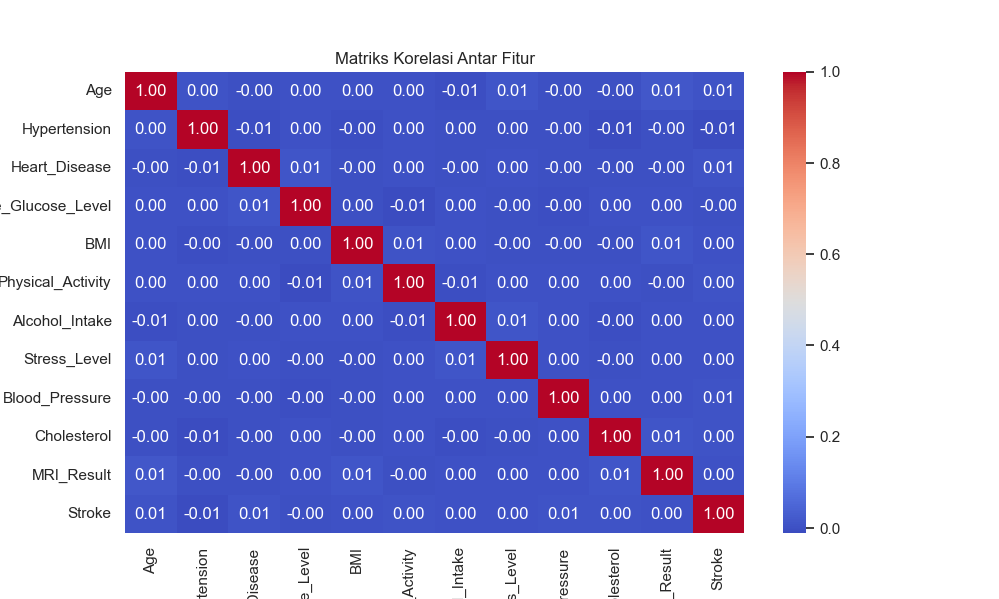
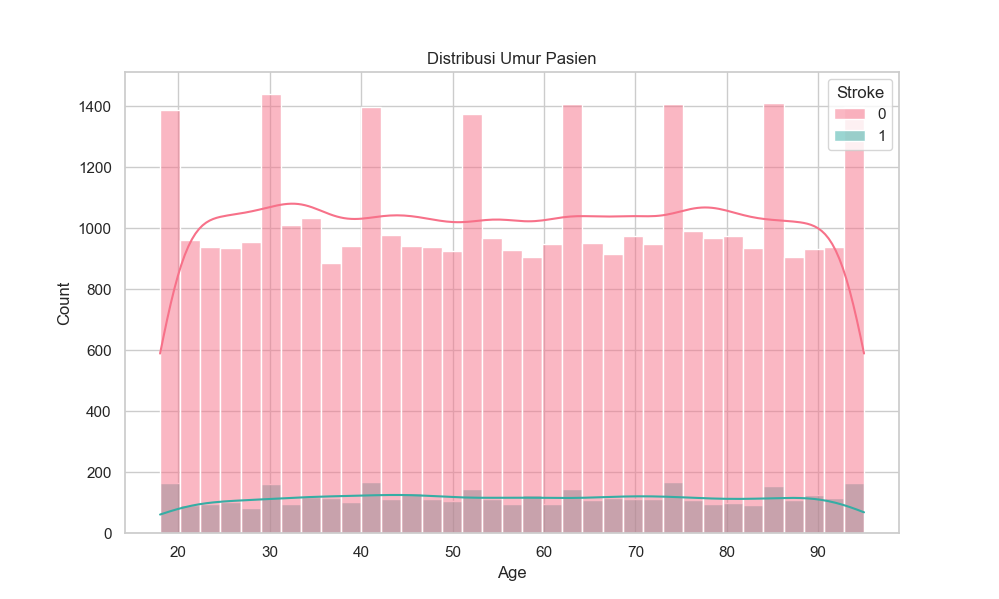
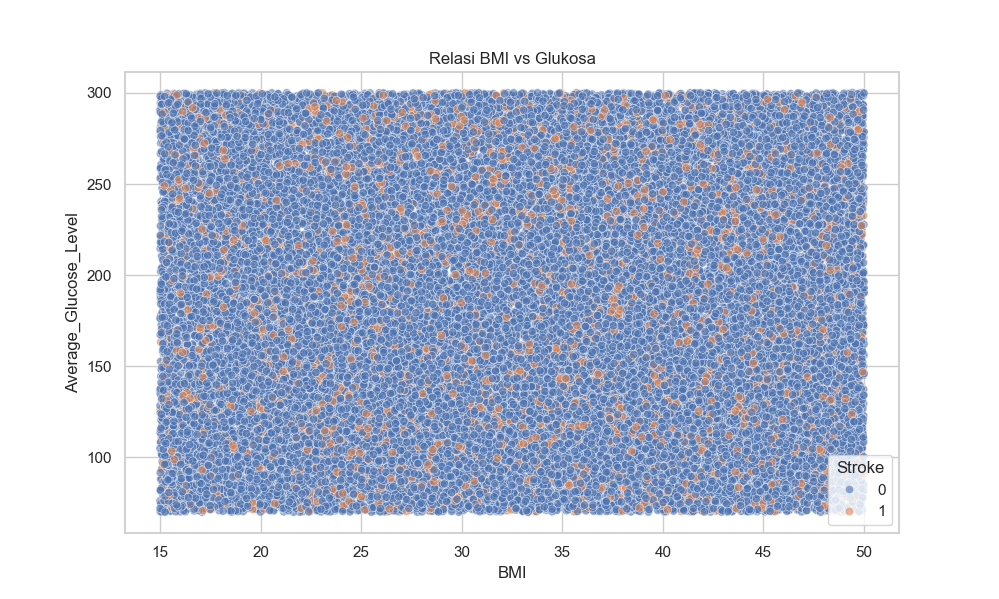

# 🏥 Stroke Analysis App

<p align="container">
  
  
  
  
</p>

A CLI (Command Line Interface)-based data analysis application built using Python to analyze stroke patient datasets. This project includes data cleaning, statistical analysis, algorithmic search, and interactive data visualization.

## 📋 Key Features
* **Automatic Data Cleaning**: Handles missing values ​​(Mean/Mode imputation) and removes duplicate data.
* **Interactive CLI**: Interactive menu interface with easy navigation (Looping menu).
* **Data Visualization**:
* Pie Chart (Stroke Proportion)
* Heatmap (Feature Correlation)
* Histogram & KDE (Age Distribution)
* Scatter Plot (BMI vs. Glucose Relationship)
* **Searching Algorithm**: Searches for patients based on specific criteria (Age & Stroke Status).
* **Sorting Algorithm**: Sorts data by Age, Glucose, or BMI.
* **Export Data**: Saves the cleaned data to a new CSV file.
* **Cross-Platform**: Supports a clear screen on both Windows and Linux/Mac.

## 🛠️ Technology
* **Language**: Python 3.x
* **Libraries**:
* `pandas` (Data Manipulation)
* `matplotlib` & `seaborn` (Data Visualization)
* `os` & `sys` (File System Management)

## 🚀 How to Run
* **Clone this repository:**
`git clone [https://github.com/kelfinofarelino/stroke-data-analysis.git](https://github.com/kelfinofarelino/stroke-data-analysis.git)`
`cd stroke-data-analysis`
* **Install required libraries:**
`pip install -r requirements.txt`
* **Run the application:**
`python main.py`

## 📜 Changelog / Version History
* **v2.4 (Latest) - UX Improvements**:
* [UPDATE] Changed the Sorting menu input from string (type the column name) to numeric (select numbers 1-3) to minimize typos.
* [FIX] Improved error handling if a dataset column name changes (e.g., Sex vs. Gender).

* **v2.3 - Clean Interface**:
* [NEW] Added an automatic clear_screen() feature. The terminal screen will clear every time you switch menus, creating a more professional appearance. typo.
* [UPDATE] Added compatibility for Windows (cls) and Mac/Linux (clear).

* **v2.2 - Interaction Flow**:
* [NEW] Added a "Pause" feature (Press Enter to continue) after feature execution, giving the user time to read the analysis results before the main menu reappears.
* [FIX] Improved automatic file path (File Path) using os.path.join to prevent FileNotFound errors.

* **v2.1 - Robustness**:
* [FIX] Improved Data Cleaning logic for separate handling of numeric and categorical data types.
* [FIX] Backup original data (raw_df) before modifying it.

* **v2.0 - Major Refactor (OOP)**:
* [NEW] Changed the procedural code structure to Object-Oriented Programming (OOP) with the StrokeAnalysisApp class.
* [NEW] Added a main menu with a while loop to prevent the application from closing immediately.
* [NEW] Added an Export to CSV feature.

* **v1.0 - Initial Release**:
* Initial release for Data Structures coursework.
* Basic features: Load Data, Simple Stats, Simple Plotting.

## 📂 Folder Structure
```text
stroke-data-analysis/
│
├── data/
│ ├── stroke_dataset.csv # Original Dataset
│ └── cleaned_stroke_data.csv # Cleaned Data Output (Generated)
│
├── main.py # Main Source Code
├── README.md # Project Documentation
└── requirements.txt # List of Dependencies
```

Author: Muhammad Farelino Kelfin
Informatics Student, UPN "Veteran" Yogyakarta - 2024